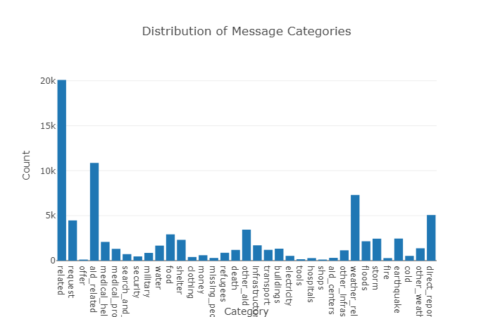

# Disaster Response Pipeline Project

Natural Language Processing Pipeline that analyzes text messages and classifies them for various disaster responses.

> This data is based on Udacity course for Data Science NanoDegree

## Getting Started

If you just want to get the system up and running, you can use the provided docker file to build the system (this requires docker to be installed on your system):

```bash
$ docker build -t felixnext/disaster_pipeline .
$ docker run -d -p 8000:3001 --name disaster_pipe felixnext/disaster_pipeline
```

The service should now run on your system and be reachable through: `https://localhost:8000/`.

In order to manually setup the system, you have to follow some distinct steps:

1. Make sure that you have the packages in `requirements.txt` installed (recommended approach: setup a virtual environment)
2. Clean the relevant data and train classifier models:
  ```bash
  $ python data/process_data.py data/disaster_messages.csv data/disaster_categories.csv data/DisasterResponse.db
  $ python models/train_classifier.py data/DisasterResponse.db models/pipeline.pkl
  ```
3. Go in the `app` folder and run `python run.py`
4. Service should now be reachable under `https://localhost:3001/`

> **NOTE:** Please note that the execution of the scripts requires 1.5+ GB of Disk Space, as it downloads pre-trained embeddings for glove. If you want to omit that, please downlaod the models manually from [here](http://nlp.stanford.edu/data/wordvecs/glove.twitter.27B.zip) and extract the relevant ones into the `models` folder. (Also comment out the download call in the `train_classifier.py` function).

## Algorithm Design

The system is divided into two parts: An ETL pipeline to load and clean the data and the machine learning pipeline to build the model. They are defined in `data/process_data.py` and `models/train_classifier.py` respectively (there are also various experiments in the `notebooks` folder). The ETL pipeline is pretty straight forward. However, the machine learning pipeline allows to provide different configurations (defined in the `config.py`). The pipeline has three distinct steps:

1. Processing: Loads the data created by the ETL pipeline and splits it into distinct features to be used by the classifiers
2. Classifier: Defines the actual classifiers used by the pipeline and which features they use
3. Training: Defines additional parameters required for the training of the classifier

I have run experiments against using different configurations. The results can be found in the `experiments.csv` file.

**Relevant Changes:**

* During the extraction phase, I dropped the `child_alone` category, as all data points were 0 (cannot reasonably be learned) - (Pipeline will extended to more categories automatically during training, therefore it can be trainined if more datapoints come available in the future)

### Experiment Design

The design of the experiments follows a sequential approach. First of all I used a `MultiOutputClassifier` and `LogisticRegression` as a baseline for the classifiers. They are working on basic simple lemmatized words embedded through TF-IDF.

From there on I experimented with the data in relation to target variables to build hypothesis about the usefulness of certain features (you can see the process in the ML Notebook).
I then tested these hypothesis against the baseline model.

The current best approach is a combination of GloVe and Tf-IDF as input features and a LogisticRegression Classifier per output category (reaching an F1-Score ~0.675).

### Data Imbalance

As the following visualization shows, the categories are rather imbalanced in the training-set.



This leads to bad classification results for data with low sample size (e.g. `water` or `tools`). Other categories (e.g. `related`) are oversampled, luring the classifier to always output 1 for the category. There are multiple solutions to solve this:

* Down-Sample the over-represented categories / Up-Sample the under-represented categories - This will lead to a more balanced classifier. Downsides can be a loss of generalization (as up-sampling shows same text snippets multiple times, while down-sampling removes novel-text snippets). Also (depending on the application) we lose some of the information embedded in the distribution of the categories, which might also lead to generalization loss in the wild.
* More Data - This might include mode data samples or additional meta-data that might allow us to better classify the under-represented categories
* Generated Data - For this approach we will look at the distribution of the generated embeddings for the single categories (or more likely for samples, as there might be latent dependencies between the categories). Based on these distributions, we can up-sample categories (which also adds negatives for the over-samples categories). One possible downside is again a lack of generalization, as we are likely to add noise to the dataset through the synthetic samples (the embeddings generated in this fashion are unlikely to capture real-world meaning - reason for this is, that a simple normal distribution (or similar dist) is a very crude abstraction and looses many of the latent information of the actual manifold in the vector-space that contains meaningful word-embeddings).

In the end the approach (or combination of approaches) depends on the context and requirements we want to use the pipeline in (e.g. do we want high precision to avoid false classifications on the data we can classify or high recall to avoid false negatives?).

## External Libraries

The code depends on various external libraries:

* Python Tool Stack (`pandas`, `numpy`, `scikit-learn`)
* Flask
* SQLAlchemy

### Experimental

* GloVe - Uses a pretrained twitter-model from [here](https://github.com/stanfordnlp/GloVe)

> Glove Training: https://github.com/JonathanRaiman/glove

## Future Work / ToDos

* Test GloVe against Word2Vec
* Integrate Neural Network approaches (FF, RNN, Bert, etc)
* Switch to `joblib` for model loading
* Data is very imbalanced (most data in the related category) - apply additional down / up sampling to ensure more balanced class distribution
* Feature weighting
* XGBoost Approach

## License

Published under MIT License
